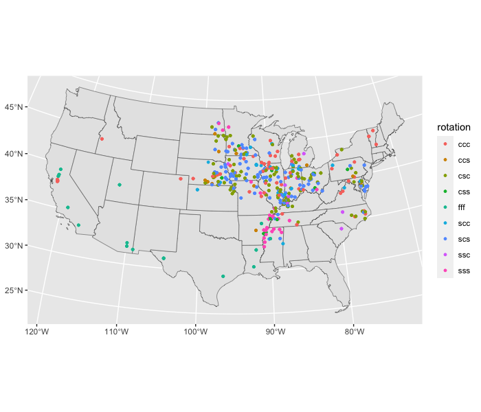
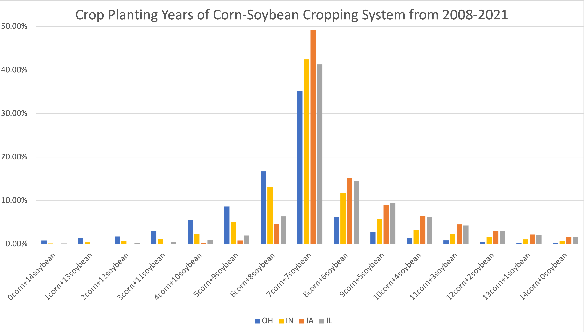
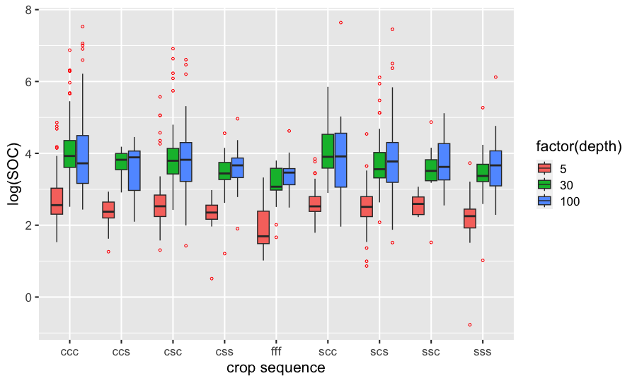

```{r setup, include=FALSE}
knitr::opts_chunk$set(cache=TRUE,
                      message=FALSE, warning=FALSE,
                      fig.path='figs/',
                      cache.path = '_cache/',
                      fig.process = function(x) {
                      x2 = sub('-\\d+([.][a-z]+)$', '\\1', x)
                      if (file.rename(x, x2)) x2 else x
                      })
```

# Introduction

Global climate change is happening faster and more drastic than expected. According to Intergovernmental Panel on Climate Change (IPCC, 2022), global warming of 1.5 \textcelsius and 2 \textcelsius will be exceeded during this century unless deep reductions in CO\textsubscript{2} and other greenhouse gas emissions occur in the coming decades. Soil is receiving increasing attention as a natural sink for carbon which can reduce atmospheric CO\textsubscript{2}. It is also a potentially large and uncertain source of CO\textsubscript{2} emissions as croplands under intensive cultivation have less soil carbon compared to pre-cultivation land uses like forests or grasslands [@lalSoilCarbonDynamics2002; @donImpactTropicalLanduse2011]. Changes in soil organic carbon stocks are a result of the imbalance between carbon inputs, mainly in the form of dead plant material or manure and outputs, mainly caused by decomposition, leaching and erosion [@poeplauCarbonSequestrationAgricultural2015]. Historically, between 32.5 and 35.7 million km$^{2}$ of natural vegetation, encompassing forests, woodlands, savannas, grasslands, and steppes have been converted to croplands [@defriesCombiningSatelliteData1999]. It is thus crucial to find effective methods to increase SOC stocks while simultaneously enhancing and maintaining high agricultural productivity.

Many efforts have been devoted to examining the effects of cropland management practices on soil carbon storage, including cover cropping, intensified rotations, minimum tillage, advance nutrient management, and integrated crop-livestock systems [@dickImpactsAgriculturalManagement1998], [@paustianClimatesmartSoils2016]. Crop species choices, however, are usually overlooked as a way to increase soil organic carbon. Current findings include comparing long-term or short-term effects of perennial, semi-perennial, and annual crops [@ferchaudChangesSoilCarbon2016], carbon benefits of converting traditional crops into biomass energy crops [@chenAssessingReturnsLand2021] or to permanent herbaceous cover [@swanPrincetonNetZeroAmerica]. However, under the pressure of food security, there is a need to identify the various effects of soil carbon within the traditional cropping system that increases soil organic matter and is supportive of enhanced food production and other ecosystem services.

With this goal in mind, we estimate the impact of the sequences of the most predominant crops - corn and soybean on soil organic carbon (SOC) stocks. We find corn-soybean rotation significantly increases SOC stocks as deep as 100 cm compared to always fallow, with corn having a stronger impact on increasing SOC stocks compared to soybean. Specifically, monocropping of corn in the past three years increases SOC stocks in 100 cm by 15.03% compared to monocropping of soybean, and by 12.41% compared to corn for one year followed by soybean for two years. Evidence also shows that having corn for two years in the past three years results in higher SOC stocks than if not. Taking the soil health and crop yield into consideration, having corn for two years and soybean for one year is suggested to be the best cropping sequence. Applying this result to Corn Belt states - Ohio, Indiana, Iowa, and Illinois, we estimate that the total potential increase of SOC stocks by transferring current soils covered by continuous soybean, soybean for two years and corn for one year, or always fallow into corn for two years and soybean for one year in every three years is about 22 million Mg in Ohio, 45 million Mg in Indiana, 92 million Mg in Iowa, and 44 million Mg in Illinois.

# Soil carbon effects of different corn-soybean sequences

We estimate the impact of crop types on SOC stocks by linking Rapid Carbon Assessment (RaCA) with Crop Data Layer (CDL). We obtain the measurements of SOC stocks and soil characteristics at depths of 5cm, 30 cm, and 100 cm at 2,105 cropland sites from RaCA data, which was conducted by USDA-NRCS between 2010 to 2011 in order to provide contemporaneous measurements of SOC across the US. A multi-level stratified random sampling scheme was created using major land resource area (MLRA) and then a combination of soil groups and land use/land cover classes. Next, using the latitude and longitude of RaCA sites, we extract crop types from CDL the year when collected by RaCA, one year before, and two years before. The CDL from USDA-NASS is an annual raster, geo-referenced, crop-specific land cover data layer (2008-) with a ground resolution of 30 or 56 meters depending on the state and year. We also extract quarterly mean temperature and mean precipitation at each site from PRISM Climate Data. Due to the different inputs and management across different crops, which are hard to control, here we consider the in aggregate effects of crop species on soil carbon and assume that management is homogeneous within each crop type. Figure 1 shows the distribution of crop types over the last two years. We can find corn-soybean rotation is the predominant cropping system in the U.S.


Then we focus on the 9 cropping sequences - continuous corn, continuous soybean, always fallow, and corn-soybean rotation including corn-corn-soybean, corn-soybean-corn, corn-soybean-soybean, soybean-corn-corn, soybean-corn-soybean, and soybean-soybean-corn (the order indicates crop type two years before-one year before -this year). We constrain the sites to be covered by either corn or soybean or fallow in the past three years. We model the SOC stocks in depths of 1 to 100 cm at each site as a function of cropping sequences in the past 3 years. Control variables include environmental characteristics including quarterly mean temperature, quarterly mean precipitation, latitude, as well as soil texture. We also include region, year and month fixed effects. In order to control for pretreatment imbalances, we use Propensity Score Matching (PSM), where the propensity score is the probability of a site being cropped with different treatments separately as a function of the environmental/soil characteristics. 

```{=latex}
\begin{equation}\label{eq2}
         log\left(SOC_{it}\right)=\beta_{0}
       +\beta_{1} Envr_{it}
        +\beta_{2} Soil _{i}
        +\beta_{4} Rotation_{it}  
        + \beta_{5} X_{it}+\varepsilon_{it} 
\end{equation}


where i indexes site and t indexes the observed time. $ SOC_{\mathrm {it}} $ denotes the amount of soil carbon stock (Mg/ha) for site i in year t. $ \mathrm {Envr}_{it} $ are environmental variables at site i in year t including mean temperature, mean precipitation, and latitude. $ \mathrm {Soil}_{i} $ denotes soil characteristics variables at site i (soil texture). $ \mathrm {Rotation}_{it} $ indicates the cropping sequence at site i in year t, 1 year before year t, and 2 years before year t. $ \mathrm{X}_{it} $ are region fixed effect and time fixed effect (year and month). $ \mathrm \varepsilon_{it} $ is error term.
```


Results in Table 1 indicate crops have different impacts on SOC stocks at different depths with a lag effect. We find corn-soybean rotation significantly increases SOC stocks as deep as 100 cm compared to always fallow, with corn having a stronger impact on increasing SOC stocks compared to soybean. Specifically, monocropping of corn in the past three years increases SOC stocks in 100 cm by 15.03% compared to monocropping of soybean, by 12.41% compared to corn-soybean-soybean, and by 23.99% compared to always fallow. Evidence also shows that having corn for two years in the past three years results in higher SOC stocks than if not. Corn-soybean-corn increases SOC stocks in 100 cm by 16.30% compared to monocropping of soybean, by 14.00% compared to corn-soybean-soybean, and by 13.88% compared to always fallow. Soybean-corn-corn increases SOC stocks in 100 cm by 12.98% compared to monocropping of soybean, by 15.14% compared to corn-soybean-soybean, and by 15.84% compared to always fallow. Corn plays an important role in the cropping system in improving SOC stocks, which might be explained by high residues after harvest.


```{=latex}
\begin{table}[tbp]
\begin{center}
\caption{The effects of different sequences of corn-soybean rotation on log(SOC(0-100cm)) stocks}
\resizebox{0.8\textwidth}{!}{
\begin{tabular}{@{\extracolsep{5pt}}lccccccccc}
\\[-1.8ex]\hline
\hline \\[-1.8ex]
 & \multicolumn{9}{c}{\textit{Dependent variable:}} \\
\cline{2-10}
\\[-1.8ex] & \multicolumn{9}{c}{log(SOCstock100)} \\
\\[-1.8ex] & (1) & (2) & (3) & (4) & (5) & (6) & (7) & (8) & (9)\\
\hline \\[-1.8ex]
 relevel(treat, control)ccs & $-$0.054 &  & $-$0.096$^{*}$ & 0.029 & 0.074 & $-$0.054 & $-$0.036 & $-$0.0003 & 0.068 \\
  & (0.051) &  & (0.049) & (0.069) & (0.072) & (0.053) & (0.051) & (0.076) & (0.070) \\
  & & & & & & & & & \\
 relevel(treat, control)ccc &  & 0.036 & $-$0.040 & 0.117$^{*}$ & 0.215$^{***}$ & 0.020 & 0.019 & 0.064 & 0.140$^{**}$ \\
  &  & (0.055) & (0.036) & (0.069) & (0.072) & (0.049) & (0.037) & (0.076) & (0.064) \\
  & & & & & & & & & \\
 relevel(treat, control)csc & $-$0.008 & 0.034 &  & 0.131$^{*}$ & 0.130$^{*}$ & 0.028 & 0.009 & $-$0.010 & 0.151$^{**}$ \\
  & (0.037) & (0.055) &  & (0.069) & (0.072) & (0.049) & (0.034) & (0.076) & (0.064) \\
  & & & & & & & & & \\
 relevel(treat, control)css & $-$0.094$^{*}$ & $-$0.040 & $-$0.136$^{***}$ &  & 0.034 & $-$0.094$^{*}$ & $-$0.076 & $-$0.036 & 0.028 \\
  & (0.054) & (0.057) & (0.051) &  & (0.075) & (0.056) & (0.054) & (0.076) & (0.073) \\
  & & & & & & & & & \\
 relevel(treat, control)fff & $-$0.127$^{**}$ & $-$0.074 & $-$0.169$^{***}$ & $-$0.031 &  & $-$0.128$^{**}$ & $-$0.110$^{**}$ & $-$0.044 & $-$0.006 \\
  & (0.051) & (0.055) & (0.049) & (0.069) &  & (0.053) & (0.051) & (0.076) & (0.070) \\
  & & & & & & & & & \\
 relevel(treat, control)scc & 0.001 & 0.060 & $-$0.041 & 0.141$^{**}$ & 0.147$^{**}$ &  & 0.018 & 0.032 & 0.122$^{*}$ \\
  & (0.046) & (0.055) & (0.044) & (0.069) & (0.072) &  & (0.046) & (0.076) & (0.066) \\
  & & & & & & & & & \\
 relevel(treat, control)scs & $-$0.033 & $-$0.027 & $-$0.079$^{**}$ & 0.032 & 0.053 & $-$0.031 &  & $-$0.026 & 0.065 \\
  & (0.037) & (0.055) & (0.033) & (0.069) & (0.072) & (0.049) &  & (0.076) & (0.064) \\
  & & & & & & & & & \\
 relevel(treat, control)ssc & $-$0.053 & 0.001 & $-$0.095 & 0.041 & 0.075 & $-$0.053 & $-$0.035 &  & 0.069 \\
  & (0.060) & (0.063) & (0.058) & (0.075) & (0.082) & (0.062) & (0.060) &  & (0.078) \\
  & & & & & & & & & \\
 relevel(treat, control)sss & $-$0.107$^{**}$ & $-$0.077 & $-$0.148$^{***}$ & $-$0.027 & 0.028 & $-$0.082$^{*}$ & $-$0.089$^{**}$ & 0.018 &  \\
  & (0.043) & (0.055) & (0.041) & (0.069) & (0.072) & (0.049) & (0.043) & (0.076) &  \\
  & & & & & & & & & \\
 Constant & 1.548$^{***}$ & 1.494$^{***}$ & 1.590$^{***}$ & 1.454$^{***}$ & 1.420$^{***}$ & 1.548$^{***}$ & 1.530$^{***}$ & 1.495$^{***}$ & 1.426$^{***}$ \\
  & (0.030) & (0.039) & (0.029) & (0.049) & (0.051) & (0.035) & (0.031) & (0.053) & (0.055) \\
  & & & & & & & & & \\
\hline \\[-1.8ex]
Observations & 205 & 110 & 244 & 96 & 110 & 135 & 244 & 72 & 140 \\
Log Likelihood & 107.023 & 63.914 & 136.429 & 42.140 & 34.272 & 71.333 & 125.438 & 37.629 & 64.689 \\
Akaike Inf. Crit. & $-$196.047 & $-$109.828 & $-$254.859 & $-$66.280 & $-$50.543 & $-$124.667 & $-$232.876 & $-$57.259 & $-$111.377 \\
\hline
\hline \\[-1.8ex]
\textit{Note:}  & \multicolumn{9}{r}{$^{*}$p$<$0.1; $^{**}$p$<$0.05; $^{***}$p$<$0.01} \\
\end{tabular}
}
\end{center}
\end{table}
```

Based on the result, we propose nine hypothetical policies - converting fallow-fallow-fallow, soybean-soybean-soybean, and corn-soybean-soybean to corn-corn-corn separately, converting fallow-fallow-fallow, soybean-soybean-soybean, and corn-soybean-soybean to corn-soybean-corn separately, converting fallow-fallow-fallow, soybean-soybean-soybean, and corn-soybean-soybean to soybean-corn-corn separately. Due to the unequal population variances, we choose to do one-tailed Welch two-sample t-test. Table 2 shows that the policies could increase the SOC stocks at 10% significance level.


| >0      | estimate | t-value | p-value  | 95% conf.low | 95% conf.high |
|---------|----------|---------|----------|--------------|---------------|
| ccc-fff | 249      | 3.84    | 0.000157 | 141          | Inf           |
| ccc-sss | 209      | 2.99    | 0.00193  | 92.2         | Inf           |
| ccc-css | 223      | 3.35    | 0.000691 | 112          | Inf           |
|---------|----------|---------|----------|--------------|---------------|
| csc-fff | 104      | 3.72    | 0.000161 | 57.5         | Inf           |
| csc-sss | 63.1     | 1.67    | 0.0498   | 0.0826       | Inf           |
| csc-css | 77.4     | 2.47    | 0.0079   | 25.2         | Inf           |
|---------|----------|---------|----------|--------------|---------------|
| scc-fff | 184      | 1.74    | 0.0483   | 1.94         | Inf           |
| scc-sss | 144      | 1.32    | 0.0999   | -43          | Inf           |
| scc-css |  158     | 1.48    | 0.0769   | -25.7        | Inf           |

: Welch Two Sample t-test


# Corn-soybean cropping systems in the Corn Belt

As Figure 2 shows, most of the corn-soybean rotation observations center in the Corn Belt. We randomly sampled 40,000 points within CDL in Ohio, Indiana, Iowa, and Illinois, separately from 2008 to 2021 to track the crop types on the same points across time. As Figure 3 shows, planting each of corn and soybean equally for 7 years in the past 14 years is a large majority. The percentage decreases with the deviation from the center. Among the four states, farmers in Ohio and Indiana tend to prefer planting soybean more often, while farmers in Iowa and Illinois tend to prefer planting corn more often.





Applying the result of SOC stocks discussed above, we estimate the potential increase of SOC stocks with nine hypothetical policies as Table 3 shows. We estimate that the total potential increase of SOC by converting fallow-fallow-fallow, soybean-soybean-soybean, and corn-soybean-soybean to corn-corn-corn is 20 million Mg, 43 million Mg, 71 million Mg, and 62 million Mg for Ohio, Indiana, Iowa, and Illinois separately. The total potential increase of SOC by converting fallow-fallow-fallow, soybean-soybean-soybean, and corn-soybean-soybean to corn-soybean-corn is estimated to be 22 million Mg, 45 million Mg, 92 million Mg, and 44 million Mg for Ohio, Indiana, Iowa, and Illinois separately. The total potential increase of SOC by converting fallow-fallow-fallow, soybean-soybean-soybean, and corn-soybean-soybean to soybean-corn-corn is estimated to be 23 million Mg, 47 million Mg, 99 million Mg, and 47 million Mg for Ohio, Indiana, Iowa, and Illinois separately. The second and the third policy (converting fallow-fallow-fallow, soybean-soybean-soybean, and corn-soybean-soybean to corn-soybean-corn or soybean-corn-corn) are estimated to have higher gain in SOC stocks on the whole compared to the first one (converting fallow-fallow-fallow, soybean-soybean-soybean, and corn-soybean-soybean to corn-corn-corn). Taking the soil health and crop yield into consideration, having corn for two years and soybean for one year is suggested to be the best cropping sequence.


| policy     | OH            | IA            | IL            | IN            | Corn Belt      |
|------------|---------------|---------------|---------------|---------------|----------------|
| fff to ccc | 30,075.21     | 0.00          | 19,608.11     | 0.00          | 49,683.32      |
| sss to ccc | 4,385,512.96  | 1,319,692.44  | 2,911,428.11  | 4,453,460.47  | 8,616,633.51   |
| css to ccc | 15,356,574.46 | 69,244,881.13 | 59,176,222.83 | 38,758,940.90 | 143,777,678.43 |
| total      | 19,772,162.63 | 70,564,573.57 | 62,107,259.06 | 43,212,401.38 | 152,443,995.26 |
|------------|---------------|---------------|---------------|---------------|----------------|
| fff to csc | 17,407.07     | 0.00          | 11,348.87     | 0.00          | 28,755.94      |
| sss to csc | 4,756,810.31  | 1,431,423.57  | 3,157,922.78  | 4,830,510.57  | 9,346,156.66   |
| css to csc | 17,317,398.75 | 90,182,317.00 | 40,779,343.87 | 39,941,649.89 | 148,279,059.62 |
| total      | 22,091,616.13 | 91,613,740.57 | 43,948,615.52 | 44,772,160.46 | 157,653,972.22 |
|------------|---------------|---------------|---------------|---------------|----------------|
| fff to scc | 19,855.30     | 0.00          | 12,945.04     | 0.00          | 32,800.34      |
| sss to scc | 3,786,676.71  | 1,139,490.11  | 2,513,876.29  | 3,845,346.08  | 7,440,043.11   |
| css to scc | 18,734,890.16 | 97,564,064.23 | 44,117,279.93 | 43,211,017.69 | 160,416,234.33 |
| total      | 22,541,422.17 | 98,703,554.34 | 46,644,101.26 | 47,056,363.77 | 167,889,077.78 |


: Potential increase of SOC stocks (Mg) across polices and states


\newpage
# Appendix


| Variable                          |           | Mean   | Sd     | Min    | Max     | N    |
|-----------------------------------|-----------|--------|--------|--------|---------|------|
| Soil Organic Carbon (Mg/ha)       | 0-5 cm    | 16.82  | 22.04  | 0.46   | 262.26  | 367  |
|                                   | 5-30 cm   | 66.92  | 108.87 | 2.78   | 1005.52 | 364  |
|                                   | 30-100 cm | 94.63  | 221.47 | 4.17   | 2076.73 | 334  |
|-----------------------------------|-----------|--------|--------|--------|---------|------|
| Crop sequences                    | ccc       |        |        |        |         | 181  |
|                                   | ccs       |        |        |        |         | 41   |
|                                   | csc       |        |        |        |         | 287  |
|                                   | css       |        |        |        |         | 35   |
|                                   | fff       |        |        |        |         | 46   |
|                                   | scc       |        |        |        |         | 69   |
|                                   | scs       |        |        |        |         | 304  |
|                                   | ssc       |        |        |        |         | 26   |
|                                   | sss       |        |        |        |         | 76   |
|-----------------------------------|-----------|--------|--------|--------|---------|------|
| Soil texture                      | Clay      |        |        |        |         | 47   |
|                                   | Loam      |        |        |        |         | 902  |
|                                   | Sand      |        |        |        |         | 50   |
|-----------------------------------|-----------|--------|--------|--------|---------|------|
| Year                              | 2010      |        |        |        |         | 493  |
|                                   | 2011      |        |        |        |         | 572  |
|-----------------------------------|-----------|--------|--------|--------|---------|------|
| Latitude (degree)                 |           | 40.07  | 3.14   | 29.4   | 47.34   | 1065 |
|-----------------------------------|-----------|--------|--------|--------|---------|------|
| Mean temperature (degree celsius) | Spring    | 11.56  | 3.3    | 2.02   | 22.34   | 1065 |
|                                   | Summer    | 24.06  | 2.23   | 17.87  | 30.39   | 1065 |
|                                   | Autumn    | 12.77  | 2.76   | 6.21   | 22.34   | 1065 |
|                                   | Winter    | -2.65  | 5.22   | -13.51 | 11.73   | 1065 |
|-----------------------------------|-----------|--------|--------|--------|---------|------|
| Mean precipitaiton (inch)         | Spring    | 112.11 | 55.65  | 0      | 271.94  | 1065 |
|                                   | Summer    | 118.46 | 46.01  | 1.89   | 243.19  | 1065 |
|                                   | Autumn    | 80.21  | 41.73  | 4.05   | 221.42  | 1065 |
|                                   | Winter    | 56.25  | 35.17  | 3.82   | 169.71  | 1065 |

: Descriptive statistics summary


```{=latex}
\begin{table}[!htbp] \centering 
  \caption{The effects of crop type on log(SOC(0-100 cm)) stocks} 
  \resizebox{0.8\textwidth}{!}{ 
  \label{} 
\begin{tabular}{@{\extracolsep{5pt}}lccc} 
\\[-1.8ex]\hline 
\hline \\[-1.8ex] 
 & \multicolumn{3}{c}{\textit{Dependent variable:}} \\ 
\cline{2-4} 
\\[-1.8ex] & \multicolumn{3}{c}{log(SOC)} \\ 
 & 0-5 cm & 5-30 cm & 30-100 cm \\ 
\\[-1.8ex] & (1) & (2) & (3)\\ 
\hline \\[-1.8ex] 
 relevel(as.factor(CDL\_0), ref = "fallow")corn & 0.116 & 0.489 & 1.030$^{**}$ \\ 
  & (0.275) & (0.320) & (0.439) \\ 
  & & & \\ 
 relevel(as.factor(CDL\_0), ref = "fallow")soybean & 0.025 & 0.342 & 0.963$^{**}$ \\ 
  & (0.268) & (0.311) & (0.427) \\ 
  & & & \\ 
 relevel(as.factor(CDL\_1), ref = "fallow")corn & 0.032 & 0.160$^{**}$ & 0.147 \\ 
  & (0.068) & (0.080) & (0.113) \\ 
  & & & \\ 
 relevel(as.factor(CDL\_1), ref = "fallow")soybean &  &  &  \\ 
  &  &  &  \\ 
  & & & \\ 
 relevel(as.factor(CDL\_2), ref = "fallow")corn & 0.035 & 0.142 & 0.086 \\ 
  & (0.077) & (0.090) & (0.126) \\ 
  & & & \\ 
 relevel(as.factor(CDL\_2), ref = "fallow")soybean &  &  &  \\ 
  &  &  &  \\ 
  & & & \\ 
 Constant & 0.330 & 5.422$^{*}$ & 11.858$^{**}$ \\ 
  & (2.678) & (3.132) & (5.105) \\ 
  & & & \\ 
\hline \\[-1.8ex] 
Observations & 345 & 342 & 312 \\ 
R$^{2}$ & 0.456 & 0.438 & 0.336 \\ 
Adjusted R$^{2}$ & 0.384 & 0.364 & 0.238 \\ 
Residual Std. Error & 0.476 (df = 304) & 0.553 (df = 301) & 0.744 (df = 271) \\ 
F Statistic & 6.365$^{***}$ (df = 40; 304) & 5.876$^{***}$ (df = 40; 301) & 3.434$^{***}$ (df = 40; 271) \\ 
\hline 
\hline \\[-1.8ex] 
\textit{Note:}  & \multicolumn{3}{r}{$^{*}$p$<$0.1; $^{**}$p$<$0.05; $^{***}$p$<$0.01} \\ 
\end{tabular} 
}
\end{table} 
```



```{=latex}
\begin{table}[tbp]
\begin{center}
\caption{The effects of different sequences of corn-soybean rotation on log(SOC(0-100 cm)) stocks}
\resizebox{0.8\textwidth}{!}{
\begin{tabular}{@{\extracolsep{5pt}}lcc}
\\[-1.8ex]\hline
\hline \\[-1.8ex]
 & \multicolumn{2}{c}{\textit{Dependent variable:}} \\
\cline{2-3}
\\[-1.8ex] & log(SOCstock100) & log(SOCstock100) \\
\\[-1.8ex] & \textit{OLS} & \textit{matching} \\
\\[-1.8ex] & (1) & (2)\\
\hline \\[-1.8ex]
 relevel(as.factor(rotation), ref = "fff")ccc & 0.787$^{**}$ & 1.130$^{***}$  \\
  & (0.331)  & (0.344) \\
  & & \\
 relevel(as.factor(rotation), ref = "fff")ccs & 0.538 &  0.318 \\
  & (0.366) & (0.344) \\
  & & \\
 relevel(as.factor(rotation), ref = "fff")csc & 0.678$^{**}$ & 0.652$^{*}$  \\
  &  (0.332)  &  (0.344) \\
  & & \\
 relevel(as.factor(rotation), ref = "fff")css & 0.552 &  0.191  \\
  & (0.361) &  (0.359) \\
  & & \\
 relevel(as.factor(rotation), ref = "fff")scc & 0.742$^{**}$ & 0.656$^{*}$  \\
  &  (0.355) &   (0.344) \\
  & & \\
 relevel(as.factor(rotation), ref = "fff")scs & 0.573$^{*}$ & 0.295   \\
  & (0.329) &   (0.344) \\
  & & \\
 relevel(as.factor(rotation), ref = "fff")ssc & $-$0.015 &  0.351 \\
  & (0.410)   &   (0.394) \\
  & & \\
 relevel(as.factor(rotation), ref = "fff")sss & 0.576$^{*}$ &  0.152   \\
  &  (0.337) &  (0.344) \\
  & & \\
 Constant & 6.833$^{*}$ & 4.164$^{***}$ \\
  & (3.924) & (0.243) \\
  & & \\
\hline \\[-1.8ex]
Observations & 312 & 110 \\
R$^{2}$ & 0.420 &  \\
Adjusted R$^{2}$ & 0.324 &  \\
Log Likelihood &  & $-$137.985 \\
Akaike Inf. Crit. &  & 293.969 \\
Residual Std. Error & 0.567 (df = 267) &  \\
F Statistic & 4.392$^{***}$ (df = 44; 267) &  \\
\hline
\hline \\[-1.8ex]
\textit{Note:}  & \multicolumn{2}{r}{$^{*}$p$<$0.1; $^{**}$p$<$0.05; $^{***}$p$<$0.01} \\
\end{tabular}
}
\end{center}
\end{table}
```

\newpage
# References
