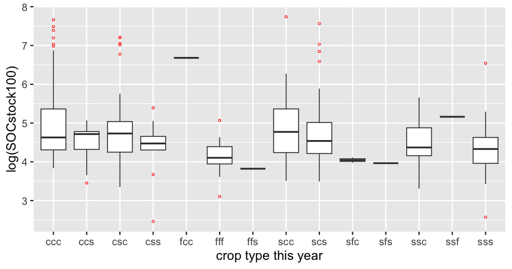
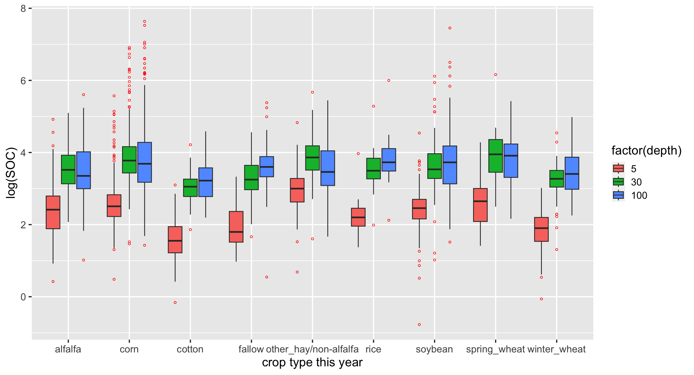

---
output: 
  pdf_document:
    citation_package: natbib
    keep_tex: true
    fig_caption: true
    latex_engine: pdflatex
    template: ~/Library/CloudStorage/OneDrive-TheOhioStateUniversity/carbon/github/AgCarbon/templates/svm-latex-ms.tex
bibliography: soilcarbon.bib
header-includes:
  -  \usepackage{hyperref}
  - \usepackage{array}   
  - \usepackage{caption}
  - \usepackage{graphicx}
  - \usepackage{siunitx}
  - \usepackage[table]{xcolor}
  - \usepackage{multirow}
  - \usepackage{hhline}
  - \usepackage{calc}
  - \usepackage{tabularx}
  - \usepackage{fontawesome}
  - \usepackage[para,online,flushleft]{threeparttable}
biblio-style: apsr
title: "Maximizing soil carbon in the Corn Belt: Corn or soybeans?"
thanks: " **Current version**: `r format(Sys.time(), '%B %d, %Y')`; **Corresponding author**: "
author:
- name: Yining Wu, Eric C. Davis, and Brent Sohngen
  affiliation: 
abstract: " Agricultural soils are receiving increasing attention as a possible carbon sink that can help nations meet their sustainability goals. This paper tries to answer whether the choice of crop and the crop rotation sequence can play a significant role in increasing soil organic carbon (SOC) stocks. Results suggest that planting continuous corn or implementing soybean-then-corn rotations can significantly increase SOC stocks in soil as deep as 100 compared to either leaving the land fallow or implementing continuous soybean rotations. Specifically, growing corn for at least two years every three years, with corn required in the final year, significantly increases the SOC by about 1.15 tons/ha compared to soybean monocropping. Applying this result to Ohio, Iowa, and Illinois, we estimate that the total potential increase of SOC stocks under three policies: 1) converting current always fallow, always soybean, and corn-soybean-soybean cropland to monocropping corn, 2) converting them to corn-soybean-corn, and 3) converting them to soybean-corn-corn. Increases are as much as 1,600g, 3,600g, and 3,250g, with the third policy generating the highest estimated SOC stocks increase."
keywords: ""
date: "`r format(Sys.time(), '%B %d, %Y')`"
geometry: margin=1in
fontfamily: libertine
fontsize: 11pt
# spacing: double
endnote: no
---

```{r setup, include=FALSE}
knitr::opts_chunk$set(cache=TRUE,
                      message=FALSE, warning=FALSE,
                      fig.path='figs/',
                      cache.path = '_cache/',
                      fig.process = function(x) {
                      x2 = sub('-\\d+([.][a-z]+)$', '\\1', x)
                      if (file.rename(x, x2)) x2 else x
                      })
```


# Introduction

Globally climate change appears to be happening faster and more dramatically than was expected. According to the Intergovernmental Panel on Climate Change (IPCC, 2022), global warming of 1.5 \textcelsius\ and 2 \textcelsius\ will be exceeded this century unless deep reductions in CO\textsubscript{2} and other greenhouse gas emissions occur in the coming decades. Agricultural soils are receiving increasing attention as a possible untapped carbon sink. However, they may also be a potentially large and uncertain source of CO\textsubscript{2} emissions, as croplands under intensive cultivation have less soil carbon compared to pre-cultivation land uses like forests or grasslands [@lalSoilCarbonDynamics2002] [@donImpactTropicalLanduse2011]. Changes in soil organic carbon (SOC) stocks are a result of the imbalance between carbon inputs, which comprise things like dead plant material and manure, and carbon outputs, which are mainly driven by decomposition, leaching, and erosion [@poeplauCarbonSequestrationAgricultural2015]. Historically, between 32.5 and 35.7 million km$^{2}$ of natural vegetation, encompassing forests, woodlands, savannas, grasslands and steppes have been converted to croplands [@defries1999combining]. <!-- Has this increased or decreased carbon stocks. You don't tie this sentence to what came before.--> It is thus crucial to find effective methods to increase SOC stocks while simultaneously enhancing and maintaining high agricultural productivity.

Many efforts have been devoted to examining the effects of cropland management practices on soil carbon storage, including cover cropping, intensified rotations, minimum tillage, advance nutrient management, and integrated crop-livestock systems [@dickImpactsAgriculturalManagement1998], [@paustianClimatesmartSoils2016]. Other work has: compared the long-term and short-term effects of planting perennial, semi-perennial, and annual crops [@ferchaudChangesSoilCarbon2016] and examined the carbon benefits of converting traditional crops into biomass energy crops [@chen2021assessing] or to permanent herbaceous cover [@swan2020princeton]. The choice of what crop to plant, however, has mostly been overlooked as a way to increase SOC. However, as food security issues are only growing in importance, there is a need to identify the various effects of different traditional cropping choices on SOC, food production, and other ecosystem services. 

With this goal in mind, we estimate the impact of the choice of the most predominant crops - corn and soybean on SOC stocks. Focusing on the impact of different sequences of corn-soybean rotation, we find planting either continuous corn or implementing soybean-then-corn rotations significantly increase SOC stocks in soil as deep as 100 compared to either leaving the land fallow or implementing continuous soybean rotations. Specifically, growing corn for at least two years every three years, with corn required in the final year, significantly increases the SOC by about 1.15 Mg/ha compared to monocropping of soybean. Applying this result to Ohio, Iowa, and Illinois, we estimate that the total potential increase of SOC by turning current corn-soybean-soybean to growing corn for at least two years in every three years are as much as 1,600g, 3,600g, and 3,250g.


# Soil carbon effects of different crops

We estimate the impact of cover crops on SOC stocks by linking Rapid Carbon Assessment (RaCA)  with Crop Data Layer (CDL). Due to the different inputs and management with different crops, which are hard to control, here we consider the in aggregate effects of crop species on soil carbon. Figure 1 shows the distribution of crop types over the last two years. We can find corn-soybean rotation is the predominant cropping system in the U.S. 


Focusing on the impact of 3 cropping sequences - continuous corn, continuous soybean, and corn-soybean rotation, we find planting corn for at least two years in every three years significantly increases SOC stocks compared to always fallow in the soil as deep as 100 cm. Specifically, 1) compared to keeping cropland always fallow, monocropping of corn significantly increase the SOC stocks by 1.24 Mg/ha, and growing corn for two years and soybean for one year significantly increase the SOC stocks by 1.15 Mg/ha. 2) Compared to monocropping of soybean, monocropping of corn significantly increase the SOC stocks by 1.15 Mg/ha, and growing corn for two years and soybean for one year significantly increase the SOC stocks by 1.14 Mg/ha. 3) Compared to growing corn for one year and soybean for two years in every three years, monocropping of corn significantly increases the SOC stocks by 1.12 Mg/ha, and growing corn for two years and soybean for one year significantly increase the SOC stocks by 1.14 Mg/ha. Corn plays an important role in the cropping system in improving SOC stocks, which might be explained by high residues after harvest.




# Corn-soybean cropping systems in the Corn Belt

We randomly sampled 40,000 points within CDL in Ohio, Iowa, and Illinois, separately from 2008 to 2021 to track the crop types on the same points across time. As Figure 3 shows, planting each of corn and soybean equally for 7 years in the past 14 years is a large majority. The percentage decreases with the deviation from the center. Among the three states, farmers in Ohio tend to prefer planting soybean more often, while farmers in Iowa and Illinois tend to prefer planting corn more often.


Applying the result of SOC stocks from RaCA, we estimate the potential increase of SOC stocks with different policies as Table 1 shows. 1) Converting always fallow, always soybean, and corn for one year followed with soybean for two years to monocropping of corn, we estimate that the total gain of SOC stocks in Ohio, Iowa, and Illinois are about 1600g, 3565g, and 3210g. 2) Converting all of them to growing corn for one year, followed by soybean for one year, and then corn for another year are estimated to increase the SOC stocks by 1622g, 3615g, and 3255g. 3) Converting all of them to growing soybean for one year followed by 2 years of corn is estimated to increase the SOC stocks by 1626g, 3649g, and 3279g. The third policy is estimated to have the highest gain in SOC stocks on the whole.  


| policy     | OH       | IA       | IL       | Corn Belt |
|------------|----------|----------|----------|-----------|
| fff to ccc | 1.44     | 0.00     | 0.93     | 2.37      |
| sss to ccc | 310.82   | 49.04    | 204.46   | 564.32    |
| css to ccc | 1,287.77 | 3,515.88 | 3,004.72 | 7,808.37  |
| total      | 1,600.03 | 3,564.92 | 3,210.10 | 8,375.06  |
|------------|----------|----------|----------|-----------|
| fff to csc | 1.32     | 0.00     | 0.85     | 2.18      |
| sss to csc | 314.26   | 49.58    | 206.72   | 570.56    |
| css to csc | 1,305.93 | 3,565.45 | 3,047.08 | 7,918.46  |
| total      | 1,621.51 | 3,615.03 | 3,254.65 | 8,491.19  |
|------------|----------|----------|----------|-----------|
| fff to scc | 1.34     | 0.00     | 0.87     | 2.21      |
| sss to scc | 305.28   | 48.16    | 200.81   | 554.25    |
| css to scc | 1,319.05 | 3,601.28 | 3,077.70 | 7,998.04  |
| total      | 1,625.68 | 3,649.45 | 3,279.38 | 8,554.50  |

Table: Potential increase of SOC stocks (g) across policys and states

# Appendix

We obtain the measurements of SOC stocks and soil characteristics at depths of 5cm, 30 cm, and 100 cm at 2,105 cropland sites from RaCA data, which was conducted by USDA-NRCS between 2010 to 2012 in order to provide contemporaneous measurements of SOC across the US. A multi-level stratified random sampling scheme was created using major land resource area (MLRA) and then a combination of soil groups and land use/land cover classes. Next, using the latitude and longitude of RaCA sites, we extract crop types from CDL the year when collected by RaCA, one year before, and two years before. The CDL from USDA-NASS is an annual raster, geo-referenced, crop-specific land cover data layer (2008-) with a ground resolution of 30 or 56 meters depending on the state and year. We also extract quarterly mean temperature and mean precipitation at each site from PRISM Climate Data. Figure 4 shows the different SOC stocks under different crops at 0-5cm, 5-30 cm, and 30-100cm depth.



We model the SOC stocks at depths of 5cm, 30 cm, and 100 cm at each site as a function of crop types in the past 3 years. Control variables include environmental characteristics including mean temperature, mean precipitation, and latitude, as well as soil texture. We also include region, year and month fixed effects.

```{=latex}
\begin{equation}\label{eq2}
         log\left(SOC_{it}\right)=\beta_{0}
       +\beta_{1} Envr_{it}
        +\beta_{2} Soil _{i}
        +\beta_{4} CDL_{it} +\beta_{5}CDL_{i\left(t-1\right)} +\beta_{6}CDL_{i\left(t-2\right)} 
        + \beta_{7} X_{it}+\varepsilon_{it} 
\end{equation}


where i indexes site and t indexes the observed time. $ SOC_{\mathrm {it}} $ denotes the amount of soil carbon stock (Mg/ha) for site i in year t. $ \mathrm {Envr}_{it} $ are environmental variables at site i in year t including mean temperature, mean precipitation, and latitude. $ \mathrm {Soil}_{i} $ denotes soil characteristics variables at site i (soil texture). $ \mathrm {CDL}_{it} $,  $ \mathrm {CDL}_{i\left(t-1\right)} $, and $ \mathrm {CDL}_{i\left(t-2\right)} $ indicate the crop type at site i in year t, the crop type at site i 1 year before year t, and the crop type at site i 2 years before year t. $ \mathrm{X}_{it} $ are region fixed effect and time fixed effect (year and month). $ \mathrm \varepsilon_{it} $ is error term.
```

Results indicate crops have different impacts on SOC stocks at different depths with a lag effect. Planting other hay (non-alfalfa) immediately increases the SOC stocks in the 5 cm uppermost layer in the same year by 1.40 Mg/ha compared to fallow cropland. Planting alfalfa or other hay 1 year before could help increase current SOC stocks in the 5 cm uppermost layer by 1.28 Mg/ha compared to fallow cropland. Planting corn or soybean 1 year before could help increase current SOC stocks in the 30 to 100 cm deep layer by 1.64 Mg/ha compared to fallow cropland. 

```{=latex}
\begin{table}[tbp]
\begin{center}
\caption{The effects of crop type on log(SOC) stocks} 
\begin{tabular}{@{\extracolsep{5pt}}lcccc} 
\\[-1.8ex]\hline 
\hline \\[-1.8ex] 
 & \multicolumn{4}{c}{\textit{Dependent variable:}} \\ 
\cline{2-5} 
\\[-1.8ex] & \multicolumn{4}{c}{log(SOC)} \\ 
 & all & 0-5 cm & 5-30 cm & 30-100 cm \\ 
\\[-1.8ex] & (1) & (2) & (3) & (4)\\ 
\hline \\[-1.8ex] 
 relevel(as.factor(CDL\_0), ref = "fallow")alfalfa & $-$0.059 & 0.176 & $-$0.020 & $-$0.304 \\ 
  & (0.116) & (0.166) & (0.168) & (0.264) \\ 
  & & & & \\ 
 relevel(as.factor(CDL\_0), ref = "fallow")corn & 0.035 & 0.216 & 0.146 & $-$0.264 \\ 
  & (0.099) & (0.141) & (0.143) & (0.229) \\ 
  & & & & \\ 
 relevel(as.factor(CDL\_0), ref = "fallow")cotton & $-$0.222$^{*}$ & $-$0.293 & $-$0.062 & $-$0.326 \\ 
  & (0.130) & (0.188) & (0.191) & (0.289) \\ 
  & & & & \\ 
 relevel(as.factor(CDL\_0), ref = "fallow")other\_hay/non-alfalfa & 0.149 & 0.337$^{*}$ & 0.125 & $-$0.050 \\ 
  & (0.126) & (0.179) & (0.180) & (0.296) \\ 
  & & & & \\ 
 relevel(as.factor(CDL\_0), ref = "fallow")rice & $-$0.014 & 0.023 & 0.055 & $-$0.139 \\ 
  & (0.165) & (0.243) & (0.245) & (0.353) \\ 
  & & & & \\ 
 relevel(as.factor(CDL\_0), ref = "fallow")soybean & $-$0.024 & 0.153 & 0.039 & $-$0.264 \\ 
  & (0.103) & (0.147) & (0.149) & (0.235) \\ 
  & & & & \\ 
 relevel(as.factor(CDL\_0), ref = "fallow")spring\_wheat & $-$0.106 & 0.022 & $-$0.036 & $-$0.290 \\ 
  & (0.135) & (0.197) & (0.198) & (0.297) \\ 
  & & & & \\ 
 relevel(as.factor(CDL\_0), ref = "fallow")winter\_wheat & $-$0.061 & $-$0.048 & 0.085 & $-$0.175 \\ 
  & (0.111) & (0.157) & (0.162) & (0.252) \\ 
  & & & & \\ \hline
 relevel(as.factor(CDL\_1), ref = "fallow")alfalfa & 0.245$^{**}$ & 0.255$^{*}$ & 0.209 & 0.376 \\ 
  & (0.108) & (0.154) & (0.155) & (0.247) \\ 
  & & & & \\ 
 relevel(as.factor(CDL\_1), ref = "fallow")corn & 0.223$^{***}$ & 0.025 & 0.213$^{*}$ & 0.504$^{***}$ \\ 
  & (0.082) & (0.118) & (0.119) & (0.181) \\ 
  & & & & \\ 
 relevel(as.factor(CDL\_1), ref = "fallow")cotton & 0.109 & 0.094 & 0.040 & 0.241 \\ 
  & (0.122) & (0.178) & (0.180) & (0.263) \\ 
  & & & & \\ 
 relevel(as.factor(CDL\_1), ref = "fallow")other\_hay/non-alfalfa & 0.264$^{**}$ & 0.287$^{*}$ & 0.265 & 0.339 \\ 
  & (0.119) & (0.170) & (0.171) & (0.273) \\ 
  & & & & \\ 
 relevel(as.factor(CDL\_1), ref = "fallow")rice & 0.081 & $-$0.058 & 0.096 & 0.244 \\ 
  & (0.124) & (0.183) & (0.184) & (0.265) \\ 
  & & & & \\ 
 relevel(as.factor(CDL\_1), ref = "fallow")soybean & 0.165$^{**}$ & $-$0.003 & 0.112 & 0.470$^{***}$ \\ 
  & (0.082) & (0.118) & (0.119) & (0.180) \\ 
  & & & & \\ 
 relevel(as.factor(CDL\_1), ref = "fallow")spring\_wheat & 0.124 & 0.017 & 0.155 & 0.212 \\ 
  & (0.120) & (0.176) & (0.177) & (0.260) \\ 
  & & & & \\ 
 relevel(as.factor(CDL\_1), ref = "fallow")winter\_wheat & 0.101 & $-$0.138 & 0.122 & 0.395$^{**}$ \\ 
  & (0.080) & (0.116) & (0.117) & (0.177) \\ 
  & & & & \\ \hline
 relevel(as.factor(CDL\_2), ref = "fallow")alfalfa & 0.051 & $-$0.121 & 0.126 & 0.064 \\ 
  & (0.112) & (0.160) & (0.162) & (0.255) \\ 
  & & & & \\ 
 relevel(as.factor(CDL\_2), ref = "fallow")corn & 0.218$^{**}$ & 0.143 & 0.305$^{**}$ & 0.179 \\ 
  & (0.101) & (0.144) & (0.148) & (0.227) \\ 
  & & & & \\ 
 relevel(as.factor(CDL\_2), ref = "fallow")cotton & 0.094 & $-$0.074 & 0.121 & 0.227 \\ 
  & (0.127) & (0.183) & (0.185) & (0.281) \\ 
  & & & & \\ 
 relevel(as.factor(CDL\_2), ref = "fallow")other\_hay/non-alfalfa & 0.119 & 0.106 & 0.089 & 0.061 \\ 
  & (0.110) & (0.158) & (0.161) & (0.249) \\ 
  & & & & \\ 
 relevel(as.factor(CDL\_2), ref = "fallow")rice & 0.110 & 0.122 & 0.162 & 0.055 \\ 
  & (0.162) & (0.237) & (0.239) & (0.344) \\ 
  & & & & \\ 
 relevel(as.factor(CDL\_2), ref = "fallow")soybean & 0.125 & 0.079 & 0.163 & 0.128 \\ 
  & (0.100) & (0.143) & (0.146) & (0.222) \\ 
  & & & & \\ 
 relevel(as.factor(CDL\_2), ref = "fallow")spring\_wheat & 0.138 & 0.008 & 0.197 & 0.204 \\ 
  & (0.144) & (0.209) & (0.211) & (0.317) \\ 
  & & & & \\ 
 relevel(as.factor(CDL\_2), ref = "fallow")winter\_wheat & 0.107 & $-$0.010 & 0.062 & 0.279 \\ 
  & (0.107) & (0.152) & (0.156) & (0.238) \\ 
  & & & & \\ 
\hline \\[-1.8ex] 
Observations & 2,105 & 733 & 726 & 646 \\ 
R$^{2}$ & 0.572 & 0.476 & 0.408 & 0.237 \\ 
Adjusted R$^{2}$ & 0.559 & 0.427 & 0.352 & 0.155 \\ 
Residual Std. Error & 0.616 (df = 2039) & 0.528 (df = 669) & 0.530 (df = 662) & 0.741 (df = 582) \\ 
F Statistic & 41.988$^{***}$ (df = 65; 2039) & 9.644$^{***}$ (df = 63; 669) & 7.257$^{***}$ (df = 63; 662) & 2.873$^{***}$ (df = 63; 582) \\ 
\hline 
\hline \\[-1.8ex] 
\textit{Note:}  & \multicolumn{4}{r}{$^{*}$p$<$0.1; $^{**}$p$<$0.05; $^{***}$p$<$0.01} \\ 
\end{tabular} 
\end{center}
\end{table}
```

Then we focus on the 3 cropping sequences - continuous corn, continuous soybean, and corn-soybean rotation. We constrain the sites to be covered by either corn or soybean or fallow in the past three years. In order to control for pretreatment imbalances, we use Propensity Score Matching (PSM), where the propensity score is the probability of a site being cropped with different treatments separately as a function of the environmental/soil characteristics.


```{=latex}
\begin{table}[tbp]
\begin{center}
\caption{The effects of different sequences of corn-soybean rotation on log(SOC(0-100 cm))}
\begin{tabular}{@{\extracolsep{5pt}}lcc} 
\\[-1.8ex]\hline 
\hline \\[-1.8ex] 
 & \multicolumn{2}{c}{\textit{Dependent variable:}} \\ 
\cline{2-3} 
\\[-1.8ex] & log(SOCstock100) & log(SOCstock100) \\ 
\\[-1.8ex] & \textit{OLS} & \textit{matching} \\ 
\\[-1.8ex] & (1) & (2)\\ 
\hline \\[-1.8ex] 
 relevel(as.factor(rotation), ref = "fff")ccc & 0.787$^{**}$ & 1.130$^{***}$  \\
  & (0.331)  & (0.344) \\ 
  & & \\ 
 relevel(as.factor(rotation), ref = "fff")ccs & 0.538 &  0.318 \\
  & (0.366) & (0.344) \\ 
  & & \\ 
 relevel(as.factor(rotation), ref = "fff")csc & 0.678$^{**}$ & 0.652$^{*}$  \\
  &  (0.332)  &  (0.344) \\ 
  & & \\ 
 relevel(as.factor(rotation), ref = "fff")css & 0.552 &  0.191  \\  
  & (0.361) &  (0.359) \\ 
  & & \\ 
 relevel(as.factor(rotation), ref = "fff")scc & 0.742$^{**}$ & 0.656$^{*}$  \\ 
  &  (0.355) &   (0.344) \\ 
  & & \\ 
 relevel(as.factor(rotation), ref = "fff")scs & 0.573$^{*}$ & 0.295   \\ 
  & (0.329) &   (0.344) \\ 
  & & \\ 
 relevel(as.factor(rotation), ref = "fff")ssc & $-$0.015 &  0.351 \\ 
  & (0.410)   &   (0.394) \\ 
  & & \\ 
 relevel(as.factor(rotation), ref = "fff")sss & 0.576$^{*}$ &  0.152   \\ 
  &  (0.337) &  (0.344) \\ 
  & & \\ 
 Constant & 6.833$^{*}$ & 4.164$^{***}$ \\ 
  & (3.924) & (0.243) \\ 
  & & \\ 
\hline \\[-1.8ex] 
Observations & 312 & 110 \\ 
R$^{2}$ & 0.420 &  \\ 
Adjusted R$^{2}$ & 0.324 &  \\ 
Log Likelihood &  & $-$137.985 \\ 
Akaike Inf. Crit. &  & 293.969 \\ 
Residual Std. Error & 0.567 (df = 267) &  \\ 
F Statistic & 4.392$^{***}$ (df = 44; 267) &  \\ 
\hline 
\hline \\[-1.8ex] 
\textit{Note:}  & \multicolumn{2}{r}{$^{*}$p$<$0.1; $^{**}$p$<$0.05; $^{***}$p$<$0.01} \\ 
\end{tabular} 
\end{center}
\end{table}

```

```{=latex}
\begin{table}[tbp]
\begin{center}
\caption{The effects of different sequences of corn-soybean rotation on log(SOC) stocks} 
\begin{tabular}{@{\extracolsep{5pt}}lccccccccc} 
\\[-1.8ex]\hline 
\hline \\[-1.8ex] 
 & \multicolumn{9}{c}{\textit{Dependent variable:}} \\ 
\cline{2-10} 
\\[-1.8ex] & \multicolumn{9}{c}{log(SOCstock100)} \\ 
\\[-1.8ex] & (1) & (2) & (3) & (4) & (5) & (6) & (7) & (8) & (9)\\ 
\hline \\[-1.8ex] 
 relevel(treat, control)ccs & $-$0.054 &  & $-$0.096$^{*}$ & 0.029 & 0.074 & $-$0.054 & $-$0.036 & $-$0.0003 & 0.068 \\ 
  & (0.051) &  & (0.049) & (0.069) & (0.072) & (0.053) & (0.051) & (0.076) & (0.070) \\ 
  & & & & & & & & & \\ 
 relevel(treat, control)ccc &  & 0.036 & $-$0.040 & 0.117$^{*}$ & 0.215$^{***}$ & 0.020 & 0.019 & 0.064 & 0.140$^{**}$ \\ 
  &  & (0.055) & (0.036) & (0.069) & (0.072) & (0.049) & (0.037) & (0.076) & (0.064) \\ 
  & & & & & & & & & \\ 
 relevel(treat, control)csc & $-$0.008 & 0.034 &  & 0.131$^{*}$ & 0.130$^{*}$ & 0.028 & 0.009 & $-$0.010 & 0.151$^{**}$ \\ 
  & (0.037) & (0.055) &  & (0.069) & (0.072) & (0.049) & (0.034) & (0.076) & (0.064) \\ 
  & & & & & & & & & \\ 
 relevel(treat, control)css & $-$0.094$^{*}$ & $-$0.040 & $-$0.136$^{***}$ &  & 0.034 & $-$0.094$^{*}$ & $-$0.076 & $-$0.036 & 0.028 \\ 
  & (0.054) & (0.057) & (0.051) &  & (0.075) & (0.056) & (0.054) & (0.076) & (0.073) \\ 
  & & & & & & & & & \\ 
 relevel(treat, control)fff & $-$0.127$^{**}$ & $-$0.074 & $-$0.169$^{***}$ & $-$0.031 &  & $-$0.128$^{**}$ & $-$0.110$^{**}$ & $-$0.044 & $-$0.006 \\ 
  & (0.051) & (0.055) & (0.049) & (0.069) &  & (0.053) & (0.051) & (0.076) & (0.070) \\ 
  & & & & & & & & & \\ 
 relevel(treat, control)scc & 0.001 & 0.060 & $-$0.041 & 0.141$^{**}$ & 0.147$^{**}$ &  & 0.018 & 0.032 & 0.122$^{*}$ \\ 
  & (0.046) & (0.055) & (0.044) & (0.069) & (0.072) &  & (0.046) & (0.076) & (0.066) \\ 
  & & & & & & & & & \\ 
 relevel(treat, control)scs & $-$0.033 & $-$0.027 & $-$0.079$^{**}$ & 0.032 & 0.053 & $-$0.031 &  & $-$0.026 & 0.065 \\ 
  & (0.037) & (0.055) & (0.033) & (0.069) & (0.072) & (0.049) &  & (0.076) & (0.064) \\ 
  & & & & & & & & & \\ 
 relevel(treat, control)ssc & $-$0.053 & 0.001 & $-$0.095 & 0.041 & 0.075 & $-$0.053 & $-$0.035 &  & 0.069 \\ 
  & (0.060) & (0.063) & (0.058) & (0.075) & (0.082) & (0.062) & (0.060) &  & (0.078) \\ 
  & & & & & & & & & \\ 
 relevel(treat, control)sss & $-$0.107$^{**}$ & $-$0.077 & $-$0.148$^{***}$ & $-$0.027 & 0.028 & $-$0.082$^{*}$ & $-$0.089$^{**}$ & 0.018 &  \\ 
  & (0.043) & (0.055) & (0.041) & (0.069) & (0.072) & (0.049) & (0.043) & (0.076) &  \\ 
  & & & & & & & & & \\ 
 Constant & 1.548$^{***}$ & 1.494$^{***}$ & 1.590$^{***}$ & 1.454$^{***}$ & 1.420$^{***}$ & 1.548$^{***}$ & 1.530$^{***}$ & 1.495$^{***}$ & 1.426$^{***}$ \\ 
  & (0.030) & (0.039) & (0.029) & (0.049) & (0.051) & (0.035) & (0.031) & (0.053) & (0.055) \\ 
  & & & & & & & & & \\ 
\hline \\[-1.8ex] 
Observations & 205 & 110 & 244 & 96 & 110 & 135 & 244 & 72 & 140 \\ 
Log Likelihood & 107.023 & 63.914 & 136.429 & 42.140 & 34.272 & 71.333 & 125.438 & 37.629 & 64.689 \\ 
Akaike Inf. Crit. & $-$196.047 & $-$109.828 & $-$254.859 & $-$66.280 & $-$50.543 & $-$124.667 & $-$232.876 & $-$57.259 & $-$111.377 \\ 
\hline 
\hline \\[-1.8ex] 
\textit{Note:}  & \multicolumn{9}{r}{$^{*}$p$<$0.1; $^{**}$p$<$0.05; $^{***}$p$<$0.01} \\ 
\end{tabular} 
\end{center}
\end{table}
```

# References
